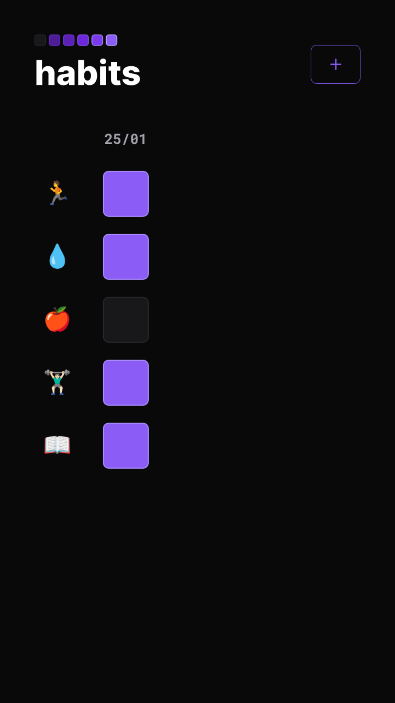

<h1 align="center"> NLW Setup </h1>

  <a href="#-tecnologias">Tecnologias</a>&nbsp;&nbsp;&nbsp;|&nbsp;&nbsp;&nbsp;
  <a href="#-sobre">Sobre</a>&nbsp;&nbsp;&nbsp;|&nbsp;&nbsp;&nbsp;
  <a href="#-preview">Preview</a>&nbsp;&nbsp;&nbsp;|&nbsp;&nbsp;&nbsp;
  <a href="#-liks">Links</a>

 

## 🧾Sobre
Site para monitorar habitos, feito juntamente com a Rocketseat.

## 🔎 Preview

  

  

## 🚀 Tecnologias

Esse projeto foi desenvolvido com as seguintes tecnologias:

- HTML e CSS
- JavaScript
- Git e Github

## ✍️ Links

Link para acessar o site: https://sammyferreira1.github.io/NLW-Setup/

---
